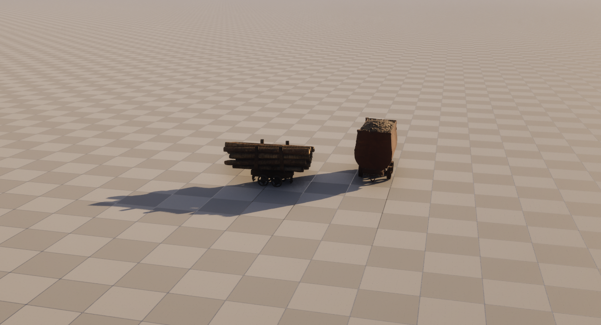
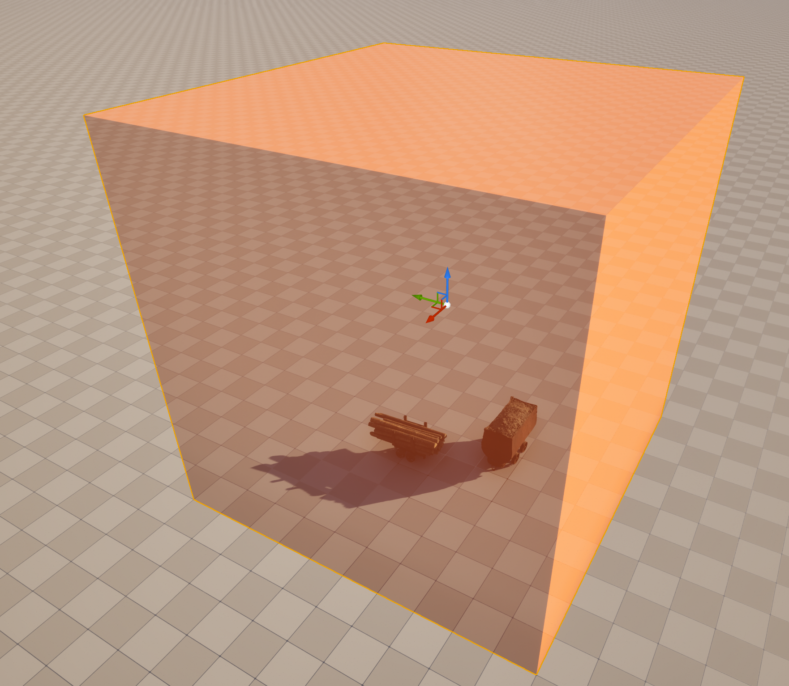
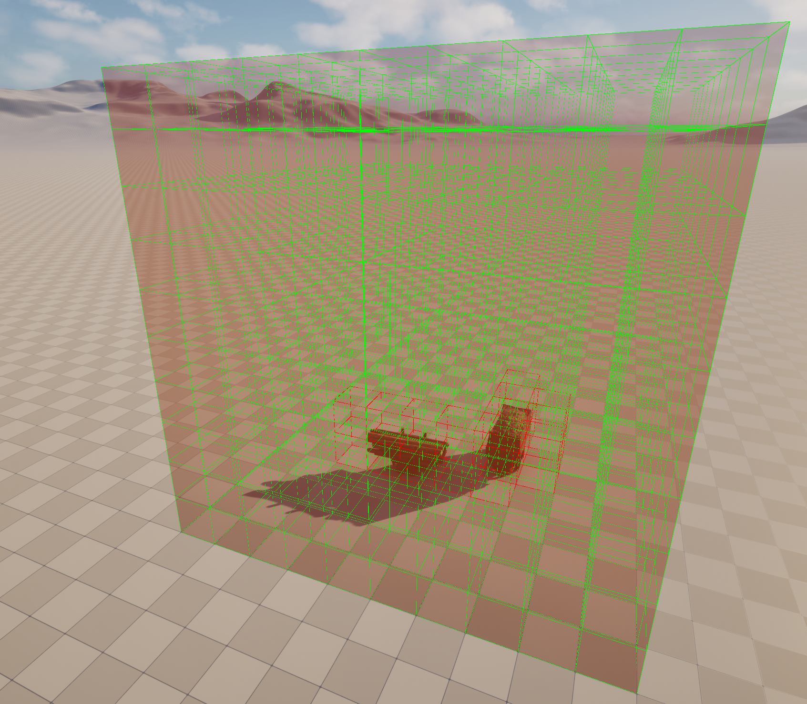
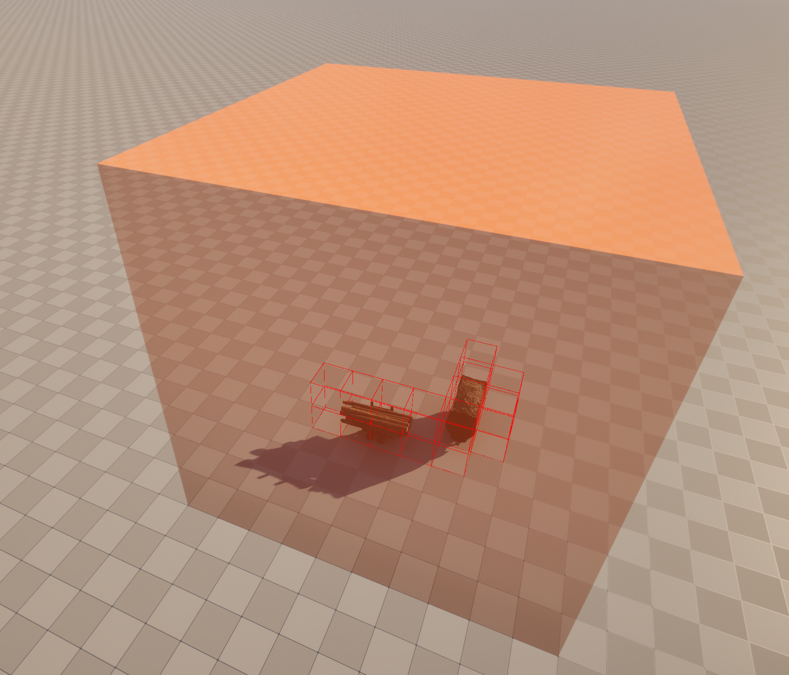
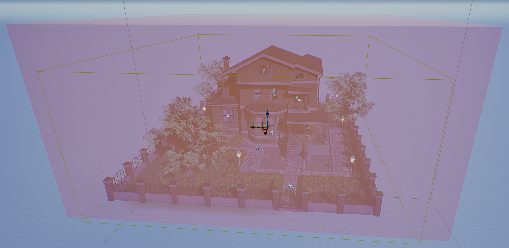
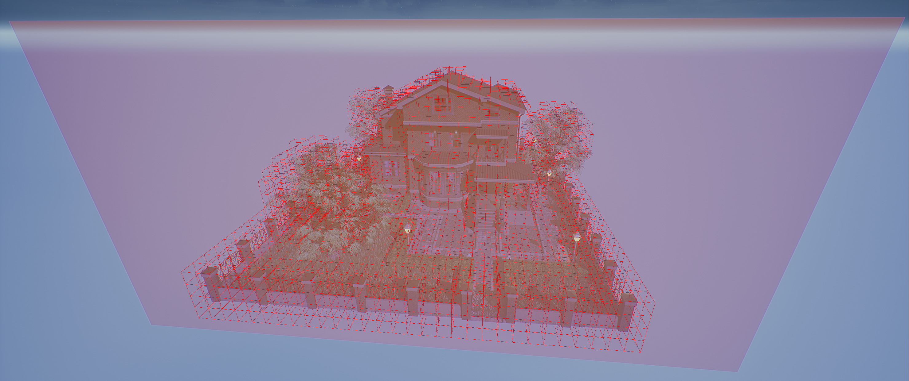
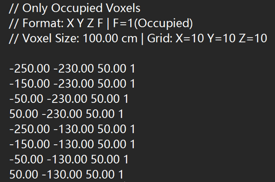
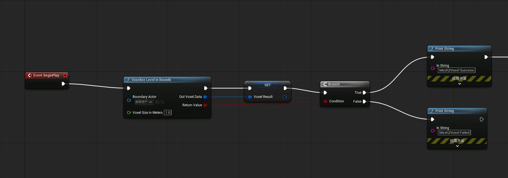
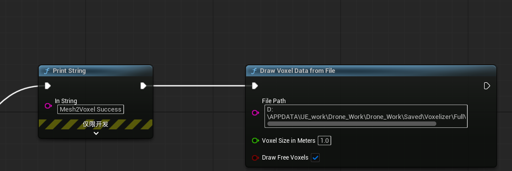
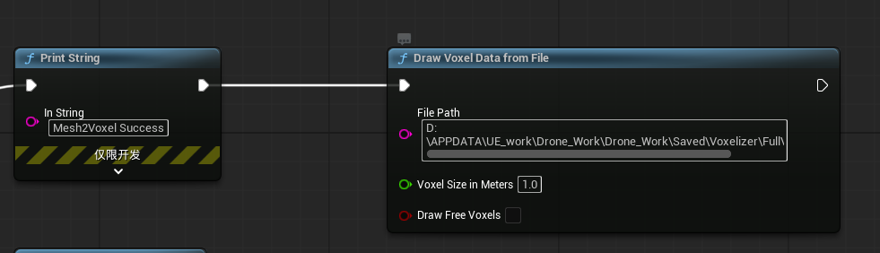

# Voxelizer

## Plugin Overview

Voxelizer is an Unreal Engine plugin that converts UE level geometry into voxel representation.

### Features
The plugin provides two functions for use in UE Blueprints: Voxelizer Level in Bounds and Draw Voxel Data from File. Voxelizer Level in Bounds converts meshes in the level to voxels and saves them as txt files, while Draw Voxel Data from File reads local txt files and visualizes voxels using wireframes in UE.
- **Voxelize Meshes in UE Level**: Converts static objects in the level to voxel grid representation based on collision detection
- **AABB Bounding Box Provided**: Content includes a bounding box asset named VoxelBox_StaticMesh with default size of 10m X 10m X 10m. The program automatically searches for actors named "VoxelBox_StaticMesh" in the scene as the voxel space boundary
- **Voxel Visualization**: Supports reading voxel data from saved local files and visualizing them in the editor using green and red wireframes
- **Voxelization Data Export**: The voxelized representation is exported as two txt files (FullVoxelData.txt and OnlyOccupied.txt)

### Dependencies
- **UE Version**: UE 5.7 and above

## Installation
Copy this plugin to the Plugins folder under your UE project root directory, then right-click on YourProject.uproject in the root directory and select Generate Visual Studio project files.

### 1. Screenshots
|  |  |
|:----:|:----:|
| <br/>UE Level Scene | <br/>Bounding Box Boundary Setup |
| <br/>Voxel Visualization Result (0 and 1) | <br/>Voxel Visualization Result (1 only) |
| <br/>Bounding Box Boundary Setup | <br/>Voxel Visualization Result (1 only) |
| <br/>Voxelization Output .txt File Representation |

### 2. Blueprint Usage Example
- 1. Open the level blueprint, call it via Event Begin event in the Event Graph.
- 2. Right-click to search for Voxelizer Level in Bounds and Draw Voxel Data from File functions.
- **PS**: The Boundary Actor parameter in Voxelizer Level in Bounds defaults to using the actor with "VoxelBox_StaticMesh" in its name when not specified.
- **PS**: The Out Voxel Data output parameter in Voxelizer Level in Bounds requires a variable of type VoxelGridData to receive the data.

|  |
|:----:|
| <br/>Calling Voxelizer Level in Bounds |
| <br/>Calling Draw Voxel Data from File (Visualize 0 and 1) |
| <br/>Calling Draw Voxel Data from File (Visualize 1) |

### 3. Output File Format

Two files are automatically generated after voxelization:

- **FullVoxelData.txt**: Contains all voxels (0=free, 1=occupied)
  ```
  // Full Voxel Data (All voxels)
  // Format: X Y Z F | F=0(Free), F=1(Occupied)
  // Voxel Size: 50.00 cm | Grid: X=10 Y=10 Z=10

  125.00 125.00 125.00 1
  125.00 125.00 175.00 0
  ...
  ```

- **OnlyOccupied.txt**: Contains only occupied voxels
  ```
  // Only Occupied Voxels
  // Format: X Y Z F | F=1(Occupied)
  // Voxel Size: 50.00 cm | Grid: X=10 Y=10 Z=10

  125.00 125.00 125.00 1
  ...
  ```

## API Reference

### FVoxelGridData

Voxelization result data structure:

| Property | Type | Description |
|----------|------|-------------|
| GridDimensions | FIntVector | Number of voxels along X/Y/Z axes |
| WorldMinBounds | FVector | World-space minimum bounds of the voxel grid |
| VoxelSize | float | Voxel size (unit: centimeters) |
| OccupancyArray | TArray<bool> | Flattened voxel occupancy array (true=occupied) |

### Function List

| Function | Description |
|----------|-------------|
| `VoxelizeLevelInBounds` | Voxelize objects within the specified bounds in the level |
| `DrawVoxelDataFromFile` | Read voxel data from file and visualize in editor |

## Notes

1. **Boundary Actor**: Ensure there is a `VoxelBox_StaticMesh` Actor in the scene, or pass the boundary Actor manually when calling
2. **Voxel Size**: Voxel size should be no less than 0.1 meters; too small voxels will cause voxel count to explode
3. **Performance**: Voxel count is affected by bounding box size and voxel size; large-scale voxelization may take longer
4. **File Output**: Voxel data files are saved in `Saved/Voxelizer/` directory
5. **Collision Detection**: Uses `ECC_WorldStatic` channel, only detects static objects

## Directory Structure

```
Voxelizer/
├── Binaries/              # Compiled DLL files
├── Content/                # Resource files (VoxelBox_StaticMesh)
├── Intermediate/           # Intermediate files
├── Resources/              # Plugin icons
├── Source/
│   └── Voxelizer/
│       ├── Private/        # Implementation files
│       └── Public/         # Header files
├── Voxelizer.uplugin       # Plugin descriptor file
└── .gitignore
```

## Changelog

- **v1.0**: Initial release, supports level voxelization and visualization
